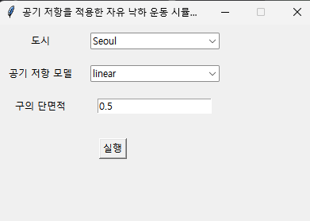
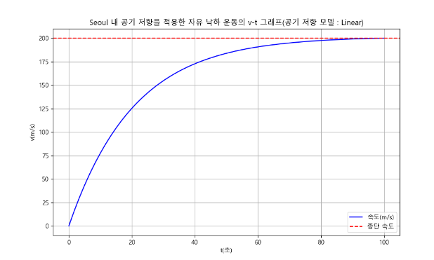

# fallsimulatorairresistance

공기 저항을 적용한 자유 낙하 운동 시뮬레이터

## 개념

공기 저항력은 속도에 비례하는 것(linear)과 속도의 제곱에 비례하는 것(quadratic)으로 나누어진다. 이 때 종단 속도는 다르게 나타난다.
또한 공기의 밀도와 물체의 성질에 따라 공기 저항 계수가 변화한다.

## 개념 적용

공기의 밀도는 지역마다 다르므로 대한민국 내 광역시 중 하나를 선택해 정밀한 대기 모델 없이 속도를 측정할 수 있는 고도인 10km에서 입력한 단면적의 구를 자유 낙하 운동하여 그에 따른 v-t 그래프를 출력하게 하였다.

## 사용법

데이터를 입력하여 실행시키면

그에 따른 v-t 그래프가 출력된다.
속도와 종단 속도를 비교할 수 있도록 하였다.
2025.07.13. 이후 에너지 변화도 확인할 수 있다.

## 필요 사항

[네이버 나눔글꼴](https://hangeul.naver.com/download)을 설치하여야 그래프가 정상적으로 출력된다.

## 사용한 라이브러리

● NumPy

● SciPy

● Matplotlib
